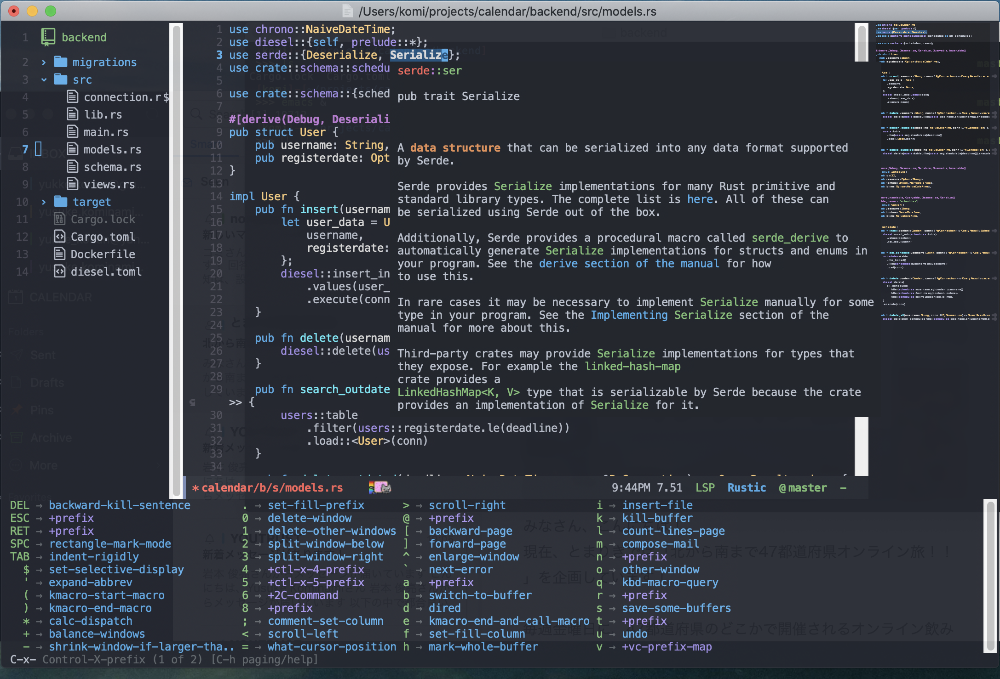

# Do you know Emacs?

Today there are many editors.
The most popular one seems Visual Stadio Code.
Nobody can complain about this fact.
And the second one may be Vim.
Nobody can also complain about this.

But...Well... By the say, do you know Emacs?

Emacs is a kind of editors and has so long history.
Today, a few people use this. 
I'm not sure why Emacs is not popular because I think this is really customizable and light-weighted.
Maybe many people consider Emacs to be an ancient weapon.

But here I declare that **Emacs still lives today**.
One of the features and merits of Emacs is easy to customize.
From my point of view, Emacs is shell or OS rather than editor.
In Emacs, you can watch YouTube, send mails or play video games.

In this article, I'll describe how to setup Emacs to be modern IDE.

# My Environment



This is my environment.
Not VSCode.
My environment has really rich UI and also blazingly fast.

## Neotree

[Neotree](https://github.com/jaypei/emacs-neotree) is a emacs tree plugin like NerdTree for Vim.


In `~/.emacs.d/init.el`, the setting is like this: 

```emacs
;; neotree
(use-package neotree
    :after
    projectile
    :commands
    (neotree-show neotree-hide neotree-dir neotree-find)
    :custom
    (neo-theme 'nerd2)
    :bind
    ("<f9>" . neotree-projectile-toggle)
    :preface
    (defun neotree-projectile-toggle ()
      (interactive)
      (let ((project-dir
         (ignore-errors
         ;;; Pick one: projectile or find-file-in-project
           (projectile-project-root)
           ))
        (file-name (buffer-file-name))
        (neo-smart-open t))
    (if (and (fboundp 'neo-global--window-exists-p)
         (neo-global--window-exists-p))
        (neotree-hide)
      (progn
        (neotree-show)
        (if project-dir
        (neotree-dir project-dir))
        (if file-name
        (neotree-find file-name)))))))
(global-set-key "\C-o" 'neotree-toggle)
```
To show or hide, set key as `Ctrl-o`.

## Minimap

[Minimap](https://github.com/dengste/minimap) shows minimap in the side buffer.


Setting is like below.

```emacs
;; Minimap
(use-package minimap
    :commands
    (minimap-bufname minimap-create minimap-kill)
    :custom
    (minimap-major-modes '(prog-mode))

    (minimap-window-location 'right)
    (minimap-update-delay 0.2)
    (minimap-minimum-width 20)
    :bind
    ("M-t m" . ladicle/toggle-minimap)
    :preface
    (defun ladicle/toggle-minimap ()
      "Toggle minimap for current buffer."
      (interactive)
      (if (null minimap-bufname)
      (minimap-create)
    (minimap-kill)))
    :config
    (custom-set-faces
     '(minimap-active-region-background
      ((((background dark)) (:background "#555555555555"))
    (t (:background "#C847D8FEFFFF"))) :group 'minimap)))
```

## Git-gutter

In modern software engineering, git is an essential for engineer team.
[Git-gutter](https://github.com/emacsorphanage/git-gutter) make


Setting is below. You can change color or sign.

```emacs
;; git-gutter
(use-package git-gutter
    :custom
    (git-gutter:modified-sign "~")
    (git-gutter:added-sign    "+")
    (git-gutter:deleted-sign  "-")
    :custom-face
    (git-gutter:modified ((t (:background "#f1fa8c"))))
    (git-gutter:added    ((t (:background "#50fa7b"))))
    (git-gutter:deleted  ((t (:background "#ff79c6"))))
    :config
    (global-git-gutter-mode +1))
```

## lsp-mode

Modern editors should have rich auto completion.
In Emacs, [lsp-mode](https://github.com/emacs-lsp/lsp-mode) can offer you rich UI and cool experience.

In my environment, `lsp-mode` is used with `company` and `yasnippet`.

```emacs
;; Company
(require 'company)
(global-company-mode) ; Turn on in all buffers
(setq company-transformers '(company-sort-by-backend-importance)) ;; Should be sorted
(setq company-idle-delay 0) ; default is 0.5
(setq company-minimum-prefix-length 3) ; default is 4
(setq company-selection-wrap-around t) ; When you reach the final, jump to the first
(setq completion-ignore-case t)
(setq company-dabbrev-downcase nil)
(global-set-key (kbd "C-M-i") 'company-complete)
(define-key company-active-map [tab] 'company-select-next) ;; select with tab
(define-key emacs-lisp-mode-map (kbd "C-M-i") 'company-complete)

;; yasnippet
(defvar company-mode/enable-yas t
  "Enable yasnippet for all backends.")
(defun company-mode/backend-with-yas (backend)
  (if (or (not company-mode/enable-yas) (and (listp backend) (member 'company-yasnippet backend)))
      backend
    (append (if (consp backend) backend (list backend))
            '(:with company-yasnippet))))
(setq company-backends (mapcar #'company-mode/backend-with-yas company-backends))

(require 'yasnippet)
(add-to-list 'load-path "~/.emacs.d/plugins/yasnippet")
(yas-global-mode 1)
```

Before using company, you should install `yasnippet`.
`yasnippet` means *Yet Another Snippets*.

```bash
$ git clone --recursive https://github.com/joaotavora/yasnippet ~/.emacs.d/plugins
```

Without this, you can use auto completion but the cursor doesn't move to appropriate position and some invalid texts exists in the file.

## ivy

`ivy` is command completion package.
There is `helm` similar to this, but I feel `ivy` is faster.

There are some packages using `ivy`.

### counsel

`counsel` enables you refine search.


```emacs
;; ivy
(require 'ivy)
(ivy-mode 1)
(setq ivy-use-virtual-buffers t)
(setq enable-recursive-minibuffers t)
(setq ivy-height 30) ;; bigger minibuffer size
(setq ivy-extra-directories nil)
(setq ivy-re-builders-alist '((t . ivy--regex-plus)))

;; counsel
(global-set-key (kbd "M-x") 'counsel-M-x)
(global-set-key (kbd "C-x C-f") 'counsel-find-file) ;; get counsel to find file
(setq counsel-find-file-ignore-regexp (regexp-opt '("./" "../")))
```

### swiper

`swiper` is word search package.
By using `ivy`, it's really fast.
And also it can do fuzzy search or retrieval search with multiple words.

```emacs
;; Swiper
(global-set-key "\C-s" 'swiper)
(setq swiper-include-line-number-in-search t)
```

### find-file-in-project

You can find files by file name.


### recentf

You can find files by your file history.
This is really good tool for jump to a many files.
For example, I'm writing this article (this article file is in `~/blog/content/post/2020-09-07-modernize-emacs/index.md`) checking my `~/.emacs.d/init.el`.
It takes high cost to jump between these files since each file path is so long.
Then this `recentf` works fine.

```emacs
;; recentf
(require 'recentf)
(recentf-mode 1)
(setq recentf-save-file "~/.emacs.d/.recentf")
(setq recentf-max-menu-items 25)
(setq recentf-max-saved-items 25)
(setq recentf-exclude '(".recentf"))
(setq recentf-auto-cleanup 'never)
(require 'recentf-ext)
(define-key global-map (kbd "C-r") 'counsel-recentf)
```

## Rust, Go, Python

I love Rust. And sometimes I write Go and Python.

I'll show each language setting.

### Rust

About Rust, I use `rustic`.
This contains `lsp`, which is `rust-analyzer` as default.

For more infomation about this, see [its repository](https://github.com/brotzeit/rustic).

```emacs
;; Rust
(require 'rustic)
(setq-default rustic-format-trigger 'on-save)
(setq rustic-rustfmt-bin "~/.cargo/bin/rustfmt")
(add-to-list 'rustic-rustfmt-config-alist '("edition" . "2018"))
;;(setq rustic-lsp-server 'rls)
(setq lsp-rust-analyzer-server-command '("~/usr/local/bin/rust-analyzer"))
```

`rustfmt` runs when you save changes.
And I have installed `rust-analyzer` via Homebrew, so here is set the path.

Note: `rustic`'s rust is edition 2015 as default, so you should add edtiion 2018 to setting.

### Go

It's easy to set your Emacs as Go IDE because all you have to do is hook with LSP.
Thanks LSP!

```emacs
;; Go
(require 'go-mode)
(add-to-list 'exec-path (expand-file-name "~/go/bin/"))
(add-hook 'go-mode-hook #'lsp-deferred)
```

### Python

About Python, `elpy` is a inclusive package, which includes some config, linter or etc.

```emacs
;; Python
(add-to-list 'exec-path (expand-file-name "~/.pyenv/shims/"))
(add-to-list 'exec-path (expand-file-name "~/.local/bin/"))
(use-package elpy
  :ensure t
  :init
  (elpy-enable))
```

## Theme and modeline

My theme and modeline are based on `Doom`.

```emacs
; cat in modeline
(nyan-mode 1)

;; modeline
(use-package doom-themes
  :custom
  (doom-themes-enable-italic t)
  (doom-themes-enable-bold t)
  :custom-face
  (doom-modeline-bar ((t (:background "#6272a4"))))
  :config
  (load-theme 'doom-vibrant t)
  (doom-themes-neotree-config)
  (doom-themes-org-config))

(use-package doom-modeline
  :custom
  (doom-modeline-buffer-file-name-style 'truncate-with-project)
  (doom-modeline-icon nil)
  (doom-modeline-major-mode-icon nil)
  (doom-modeline-minor-modes nil)
  :hook
  (after-init . doom-modeline-mode)
  :config
  (line-number-mode 0)
  (column-number-mode 0)
  (doom-modeline-def-modeline 'main
    '(bar window-number matches buffer-info remote-host buffer-position parrot selection-info)
    '(misc-info persp-name lsp github debug minor-modes input-method major-mode process vcs checker)))

(use-package hide-mode-line
  :hook
  ((neotree-mode imenu-list-minor-mode minimap-mode) . hide-mode-line-mode))

```

With `nyan-mode`, you can always look a cute cat.


## which-key

Actually I'm not familiar with Emacs key binds.
`which-key` provides you information about the meaning of each key bind.

```emacs
;; which key
(use-package which-key
  :diminish which-key-mode
  :hook (after-init . which-key-mode))
```

# Summary

My custom key bindings are like below.

```emacs
(global-set-key (kbd "M-x") 'counsel)
(global-set-key (kbd "C-s") 'swiper)
(global-set-key (kbd "C-r") 'counsel-recentf) 
(global-set-key (kbd "C-o")
```
