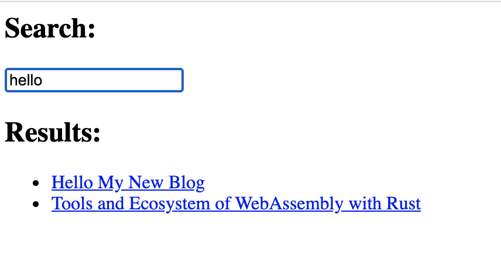

# About Tinysearch

Tinysearch is a full-text search engine for static websites built with Rust and Wasm.
This is very useful and easy to use in our static site like this blog.
And also blazingly fast.
This is because tinysearch works with WebAssembly and runs much faster than JavaScript.

In searching, tinysearch loads JSON file (like [this](/index.json), this blog's article information) for search target, browse with search query and output the results which are matched.

Repository is [here](https://github.com/tinysearch/tinysearch).


# Get Tinysearch

If you have `Cargo`, just run:

```bash
$ cargo install tinysearch
```

Tinysearch works this itself but needs `binaryen` in optimization.
You can get `binaryen` in somw ways, but if your environment is macOS and have Homebrew, Homebrew is the easiest way to get:

```bash
$ brew install binaryen
```

When you want to optimize, all you have to do is just attach flag `-o` in use.

```bash
$ tinysearch -o {path/to/json}
```


# Install Tinysearch in Hugo

## Dump JSON

The next step, setup Hugo.

As I described above, Tinysearch requires JSON file which includes articles' information (contents, URL and title).
So we have to get Hugo to output JSON file.

In Hugo, there is `layouts/` directory, which can handle the structure and design of the site.
To get Hugo to output JSON, we have to build a template in `layouts/_default/list.json.json`.
This file is like this:

```json
[
  {{ range $index , $e := .Site.RegularPages }}{{ if $index }}, {{end}}{{ dict "title" .Title "url" .Permalink "body" .Plain | jsonify }}{{end}}
]
```

With this `list.json.json`, a JSON file which is about articles is automatically generated in `public/index.json` when the site is built.

This syntax is Hugo's one, so you can easily change this.
For example, my blog's theme has a little complicated structure and my `list.json.json` is like this:

```json
{{/* Generates a valid Algolia search index */}}
{{- $.Scratch.Add "index" slice -}}
{{- $section := $.Site.GetPage "section" .Section }}
{{- range .Site.AllPages -}}
  {{- if and (eq .Section "post") (or (and (.IsDescendant $section) (and (not .Draft) (not .Params.private))) $section.IsHome) -}}
    {{- $.Scratch.Add "index" (dict "date" .Date.UTC.Unix "description" .Description "permalink" .Permalink "publishdate" .PublishDate "title" .Title "url" .RelPermalink "section" .Section "tags" .Params.Tags "categories" .Params.Categories "body" .Plain)}}
  {{- end -}}
{{- end -}}
{{- $.Scratch.Get "index" | jsonify -}}
```

This crawls only files in `content/post/`.
The template in above crawls other article (i.e. like `/top/about/`).

Tinysearch requires only 3 key-value pairs: "title": `.Title`, "url": `.Permalink` and "body": `.Plain`.
There are many key-value pairs in my example.
This is because I will extend search engine in the future.
You don't have to make like this.


## Build WebAssembly

Next, we build WebAssebly with Tinysearch.

Now you have JSON file in `public/index.json`, and we will build WebAssembly with this.
Make directory named `wasm` in `static/` to store WebAssembly files.

To build WebAssembly files, this is easy, just do this:

```bash
$ ce static/wasm
$ tinysearch ../../public/index.json
```

Then, you can find some files generated.

```bash
$ ls static/wasm 
demo.html                      tinysearch_engine.d.ts         tinysearch_engine_bg.wasm.d.ts
package.json                   tinysearch_engine.js
storage                        tinysearch_engine_bg.wasm
```

It's almost done !
Let's check `demo.html`.

```bash
$ miniserve
```

You can see this page.



JavaScript code of this is like this:

```html
<script type="module">
    import { search, default as init } from './tinysearch_engine.js';
    window.search = search;

    async function run() {
        await init('./tinysearch_engine_bg.wasm');
    }

    run();
</script>

<script>
    function doSearch() {
        let value = document.getElementById("demo").value;
        const arr = search(value, 10);
        let ul = document.getElementById("results");
        ul.innerHTML = "";

        for (i = 0; i < arr.length; i++) {
        var li = document.createElement("li");

        let elem = arr[i];
        let elemlink = document.createElement('a');
        elemlink.innerHTML = elem[0];
        elemlink.setAttribute('href', elem[1]);
        li.appendChild(elemlink);

        ul.appendChild(li);
        }
    }
</script>
```

What is done here is really easy; load WebAssembly file and run its functions.
`doSearch()` handles input value which means search query and runs Tinysearch for each input.

To enable article search, what you have to do is to write some template.
For example, this blog is like [this](https://github.com/komi1230/portfolio/blob/master/themes/hugo-theme-cleanwhite/layouts/partials/search.html).

[My GitHub repositoy about this blog](https://github.com/komi1230/portfolio) is really informative.
Good luck !