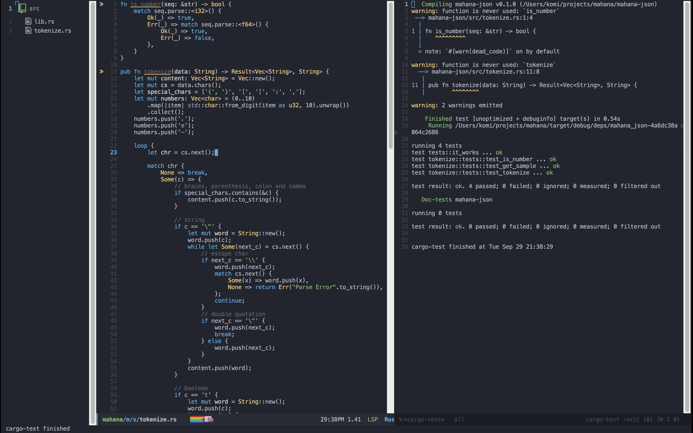

# Fullscreen as default

In writing code, I like wide screen, fullscreen is the best.

This setting makes Emacs start with fullscreen.

```emacs-lisp
(toggle-frame-fullscreen)
```

# Vertical Split

My Emacs' screen is split vertically, and the left is editor and the right is Terminal (eshell).

When splitting, the screen will be split horizontally as default.
So if Emacs finds this setting in loading init.el file, Emacs will split vertically.

```emacs-lisp
(split-window-right)
```

My screen is like this.



# Eshell

This is the most favorite part of Emacs for me.
As long as you have EShell, Terminal is not needed.

There are two kinds of Emacs user; ones who use Emacs in terminal and others who use terminal in Emacs.

Eshell enables the latter.

```emacs-lisp
M-x eshell
```

Emacs has some kinds of terminal.
Famous ones are `term`, `shell` and `eshell`.

I think `eshell` is the best choice.
The reason for this is following.

- `shell` is not stable because my `zshrc` is not properly loaded.
- `term` is stable and my `zshrc` is properly loaded, but it's slow.

On the other hand, `ehsell` is written in Emacs Lisp and it's installed as default.
Commands are a little different from standard terminal but commands are based on Emacs.
For example, in standard terminal `Ctrl-c` means to kill process, but in `ehsell` it's `C-c C-k`.

`Eshell` can be substituted with terminal.
